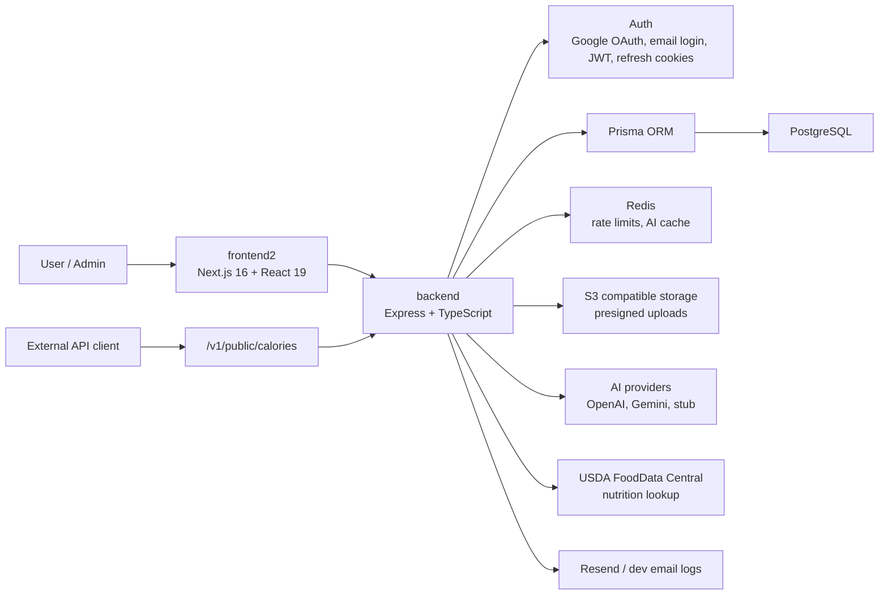
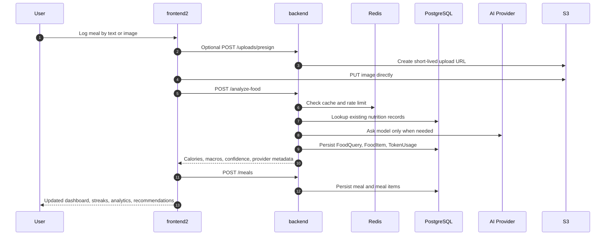
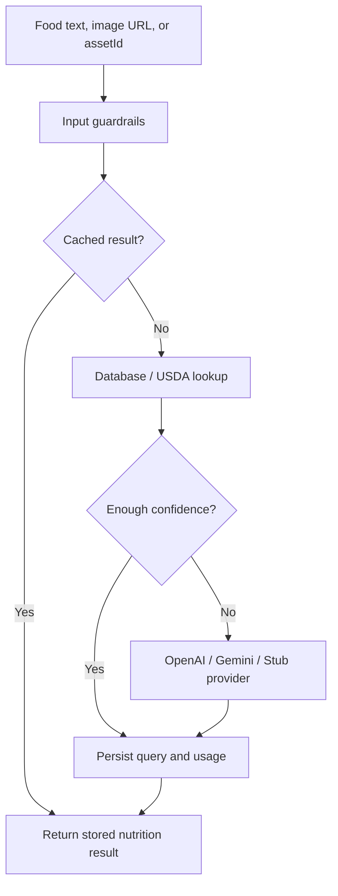
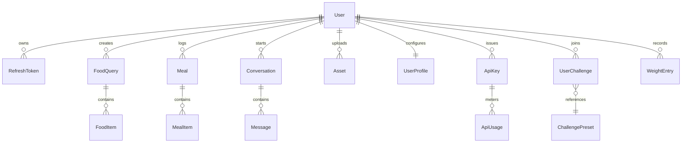
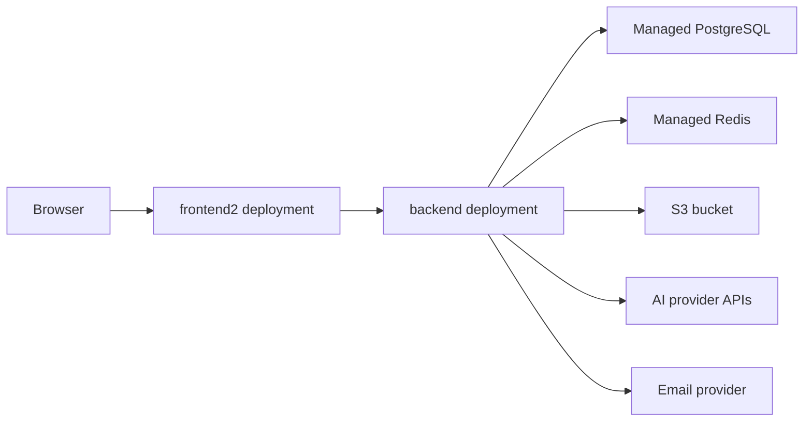

<p align="center">
  
</p>

<p align="center">
  <a href="#architecture"></a>
  <a href="#technology"></a>
  <a href="#technology"></a>
  <a href="#ai--data-flow"></a>
</p>

# NutriAI

NutriAI is a production-minded nutrition platform that turns meal photos, text logs, and user goals into calorie estimates, macro tracking, recommendations, chat guidance, streaks, admin telemetry, and a metered public calorie API.

The repository is organized around two primary folders:

- `frontend2/` - the user-facing Next.js app.
- `backend/` - the Express, Prisma, AI, auth, and API service.

## Product Surface

NutriAI is built as more than a calorie form. The application covers the full nutrition loop:

| Area | What it does |
| --- | --- |
| Meal analysis | Analyze food from text or uploaded images, then persist item-level calories and macros. |
| Daily logging | Track meals by type, daily summaries, historical entries, and deletion workflows. |
| Personalization | Store goal, body, activity, allergy, and target data; derive BMR, TDEE, calorie, and macro targets. |
| Recommendations | Rank meal suggestions from recent history using remaining calorie and macro budgets. |
| Coach chat | Maintain conversation history and answer with user nutrition context. |
| Analytics | Show daily trends, macro split, streaks, target adherence, and progress signals. |
| Weight tracking | Log weight entries and connect progress back to profile goals. |
| Challenges | Join, track, check in, complete, or abandon nutrition challenges. |
| Uploads | Use presigned S3 uploads so images do not stream through the API server. |
| API keys | Issue, list, revoke, meter, and rate-limit public API keys. |
| Admin console | Monitor users, runtime health, AI spend, API usage, activity, and failures. |

## Architecture



## Folder Structure

```text
Nutriai/
  backend/
    prisma/
      schema.prisma
    scripts/
      smoke.mjs
    src/
      ai/              # provider interface, prompts, lookup, cache, usage metering
      config/          # env, prisma, redis, logger, s3, passport
      controllers/     # request handlers
      middleware/      # auth, api key, rate limit, validation, metrics, errors
      routes/          # Express routers
      services/        # business logic and persistence orchestration
      utils/           # hashing, JWT, pagination, URL safety, typed errors
      workers/         # scheduled email digest worker
      app.ts
      server.ts
    tests/

  frontend2/
    app/
      (marketing)/     # landing experience
      (auth)/          # login, signup, verification, reset flows
      (setup)/         # onboarding
      (app)/           # dashboard, meals, snap, coach, analytics, settings, admin
      auth/            # compatibility aliases for backend email/OAuth links
      layout.tsx
      globals.css
    lib/
      api/             # typed API client modules for backend endpoints
```

## Request Flow



## AI & Data Flow

NutriAI does not treat the model as the only source of truth. The backend uses layered decision-making:

1. Normalize and hash the request.
2. Reuse Redis/database cache when possible.
3. Check existing nutrition data and USDA lookup paths.
4. Call the configured AI provider only when the request needs inference.
5. Store provider, model, latency, cache, cost, and token usage for admin reporting.



## Backend Capabilities

The `backend/` service exposes the product and platform API:

| Domain | Routes |
| --- | --- |
| Health | `GET /health`, `GET /ready`, `GET /metrics` |
| Auth | `GET /auth/google`, `GET /auth/google/callback`, `POST /auth/register`, `POST /auth/login`, `POST /auth/verify-email`, `POST /auth/refresh`, `POST /auth/logout`, `GET /auth/me` |
| Food analysis | `POST /analyze-food` |
| Meals | `POST /meals`, `GET /meals`, `GET /meals/daily-summary`, `DELETE /meals/:id` |
| History | `GET /history` |
| Chat | `POST /chat`, `GET /chat/conversations`, `GET /chat/conversations/:id`, `DELETE /chat/conversations/:id` |
| Uploads | `POST /uploads/presign`, `POST /uploads/confirm` |
| Profile | `GET /profile`, `PUT /profile`, `DELETE /profile` |
| Analytics | `GET /analytics/daily`, `GET /analytics/macros`, `GET /analytics/streak` |
| Recommendations | `GET /recommendations/meals` |
| Challenges | `GET /challenges`, `GET /challenges/me`, `POST /challenges/me`, `POST /challenges/me/:id/check-in`, `DELETE /challenges/me/:id` |
| Weight | `POST /weight`, `GET /weight`, `DELETE /weight/:id` |
| API keys | `POST /api-keys`, `GET /api-keys`, `DELETE /api-keys/:id` |
| Public API | `POST /v1/public/calories` |
| Admin | `GET /admin/overview`, `GET /admin/runtime`, `GET /admin/users`, `GET /admin/usage`, `GET /admin/activity` |

## Frontend2 Capabilities

The `frontend2/` application is wired to the backend through typed API modules in `frontend2/lib/api`.

| Page | Route | Backend-backed areas |
| --- | --- | --- |
| Landing | `/` | Product positioning and platform feature overview |
| Auth | `/login`, `/signup`, `/forgot-password`, `/reset-password`, `/verify-email` | Email auth, Google OAuth, verification, reset |
| Onboarding | `/onboarding` | Profile creation and target derivation |
| Dashboard | `/dashboard` | Daily totals, streaks, meals, recommendations, challenges |
| Snap | `/snap` | Image upload, food analysis, meal creation |
| Meals | `/meals` | Meal list, history, deletion |
| Coach | `/coach` | Chat, context, conversation history |
| Analytics | `/analytics` | Daily series, macro summaries, streaks |
| Recommendations | `/recommendations` | Ranked meal suggestions |
| Challenges | `/challenges` | Presets, active challenge, check-ins |
| Weight | `/weight` | Weight logs and profile context |
| Settings | `/settings` | Profile, API keys, public API test, account controls |
| Admin | `/admin` | Users, usage, runtime, activity |

## Technology

| Layer | Stack |
| --- | --- |
| Frontend | Next.js 16, React 19, TypeScript, Tailwind CSS 4, Framer Motion, Phosphor Icons |
| Backend | Node.js 20, Express 4, TypeScript, Zod, Passport, Helmet, pino |
| Database | PostgreSQL with Prisma ORM |
| Cache and limits | Redis with request, AI, and API-key rate controls |
| AI | OpenAI, Gemini-compatible provider path, stub provider, USDA lookup |
| Storage | AWS S3 compatible object storage with presigned upload flow |
| Email | Resend in production, stdout logging fallback in development |
| Testing | Vitest, Supertest, backend smoke script |

## Data Model Snapshot



## Local Development

### 1. Backend

```bash
cd backend
cp .env.example .env
npm install
docker compose up -d
npm run prisma:generate
npm run prisma:migrate
npm run dev
```

Backend defaults to:

```text
http://localhost:4000
```

Useful backend commands:

```bash
npm run build
npm test
npm run smoke
npm run prisma:studio
```

### 2. Frontend2

```bash
cd frontend2
npm install
npm run dev
```

Create `frontend2/.env.local` when the backend is not running on the default URL:

```env
NEXT_PUBLIC_API_URL=http://localhost:4000
```

Frontend defaults to:

```text
http://localhost:3000
```

Useful frontend commands:

```bash
npm run build
npm run lint
npm start
```

## Environment

The backend reads its environment from `backend/.env`. The most important variables are:

| Variable | Purpose |
| --- | --- |
| `DATABASE_URL` | PostgreSQL connection string |
| `REDIS_URL` | Redis connection string |
| `JWT_ACCESS_SECRET`, `JWT_REFRESH_SECRET` | Token signing secrets |
| `GOOGLE_CLIENT_ID`, `GOOGLE_CLIENT_SECRET` | Google OAuth |
| `FRONTEND_URL`, `FRONTEND_POST_LOGIN_URL` | Links and OAuth redirects back to `frontend2` |
| `RESEND_API_KEY`, `EMAIL_FROM` | Email verification and password reset |
| `AWS_*`, `AWS_S3_BUCKET` | S3 compatible uploads |
| `AI_PROVIDER` | `openai`, `gemini`, or `stub` |
| `OPENAI_API_KEY`, `GEMINI_API_KEY`, `USDA_API_KEY` | AI and nutrition lookup providers |
| `RATE_LIMIT_*` | Global API protection |

For a local `frontend2` app, keep backend redirects aligned with the frontend routes:

```env
FRONTEND_URL=http://localhost:3000
FRONTEND_POST_LOGIN_URL=http://localhost:3000/auth/callback
```

## Deployment Notes

Deploy `backend/` and `frontend2/` as separate services:



Production checklist:

- Set strong JWT secrets.
- Point `CORS_ORIGIN` and `FRONTEND_URL` to the deployed frontend URL.
- Use managed PostgreSQL and Redis.
- Configure S3 bucket permissions for presigned PUT/GET flows.
- Set `AI_PROVIDER` and provider keys.
- Configure Resend or another email route for auth flows.
- Run `npm run prisma:deploy` during backend release.
- Run `npm run build` in both `backend/` and `frontend2/`.

## Quality Signals

- Typed API boundary between frontend and backend.
- Zod validation before controller logic.
- Prisma-backed persistence and explicit model relations.
- Redis-backed caching and rate limiting.
- Public API key hashing, revocation, metering, and per-key limits.
- Admin telemetry for runtime, AI cost, users, activity, and failed calls.
- Presigned uploads so application servers do not proxy large image files.
- Provider abstraction so AI models can be swapped or stubbed.

## Current Primary App

`frontend2/` is the frontend described by this README. It is the app that should be connected to `backend/` for product use, demos, and deployment.
