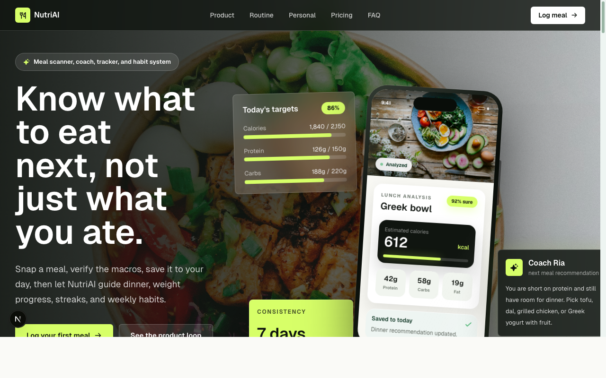

<p align="center">
  
</p>

# NutriAI

NutriAI is a nutrition tracking SaaS that helps people understand what they eat, log meals faster, and stay consistent with their health goals.

Users can sign up, complete a nutrition profile, scan or type meals, track calories and macros, chat with a nutrition coach, review progress, join challenges, and manage their account from one dashboard.

## Product Preview



More product images can be added in this section as the live website pages are finalized:

| Landing | Dashboard | Meal logging | Analytics |
| --- | --- | --- | --- |
| Website story, value, and signup flow | Daily calories, macros, meals, and streaks | Food photo/text analysis and meal history | Trends, progress, and nutrition insights |

## What NutriAI Does

- Turns food photos or text into calorie and macro estimates.
- Lets users save meals into a daily food diary.
- Shows daily calorie progress, macro totals, streaks, and recent activity.
- Builds recommendations from the user's goals and remaining daily budget.
- Provides a coach chat for nutrition questions and meal guidance.
- Tracks weight, challenges, profile goals, allergies, and preferences.
- Gives admins visibility into users, usage, activity, runtime health, and AI/API cost signals.
- Supports public API keys for future integrations or B2B use cases.

## How It Works

1. A user creates an account and signs in with email or Google.
2. The user completes onboarding with goal, body, activity, diet, and preference details.
3. NutriAI calculates daily targets and prepares the dashboard.
4. The user logs food by typing a meal or uploading a food image.
5. The backend analyzes nutrition, stores the result, and updates meals, calories, macros, streaks, and analytics.
6. The user can review history, ask the coach, follow recommendations, and track progress over time.

## Main Pages

| Page | Purpose |
| --- | --- |
| Landing | Explains the product and guides visitors to start. |
| Login and Signup | Account access with simple authentication flows. |
| Onboarding | Collects nutrition goals and personal preferences. |
| Dashboard | Daily summary, meals, progress, streaks, and recommendations. |
| Snap | Upload or capture food and turn it into a meal log. |
| Meals | Review, filter, and manage logged meals. |
| Coach | Ask nutrition questions with user context. |
| Analytics | See calories, macros, streaks, and trends. |
| Recommendations | Get meal ideas based on the current day and goals. |
| Challenges | Join and track nutrition challenges. |
| Weight | Log weight and review progress. |
| Settings | Manage profile, account, notifications, and API keys. |
| Admin | View users, usage, system health, and activity. |

## Repository

```text
Nutriai/
  frontend/   User-facing Next.js application
  backend/    API, auth, database, AI, uploads, admin, and integrations
  docs/       Project assets
```

Backend engineering details, API routes, environment variables, database models, and deployment notes live in [backend/README.md](./backend/README.md).

## Local Setup

Start the backend:

```bash
cd backend
cp .env.example .env
npm install
npm run dev
```

Start the frontend:

```bash
cd frontend
cp .env.local.example .env.local
npm install
npm run dev
```

Default local URLs:

| Service | URL |
| --- | --- |
| Frontend | `http://localhost:3000` |
| Backend | `http://localhost:4000` |

## Tech Summary

- Frontend: Next.js, React, TypeScript, Tailwind CSS
- Backend: Node.js, Express, TypeScript, Prisma
- Data: PostgreSQL and Redis
- Storage: S3-compatible image uploads
- Auth: Email/password, Google OAuth, JWT sessions
- AI: Provider-based food analysis and coach responses

## Status

NutriAI is being prepared as a public SaaS repository. The main product app is `frontend/`, and the backend details are documented separately in `backend/README.md`.
